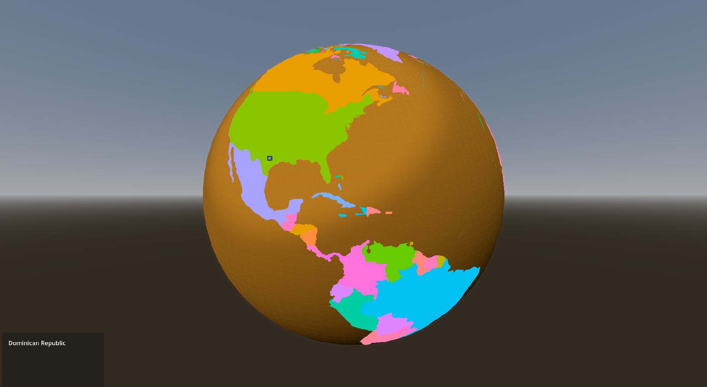

# GeoJSON for Godot - early dev 0.1
Not ready.

# Features
- [x] MultiPolygon
	- [x] Loading
	- [x] Rendering
	- [x] Mouse Detection
- [x] LineString
	- [x] Loading
	- [x] Rendering
	- [ ] Mouse Detection
- [ ] Polygon
	- [x] Loading
	- [ ] Rendering
	- [ ] Mouse Detection
- [ ] MultiLineString
	- [x] Loading
	- [ ] Rendering
	- [ ] Mouse Detection
- [x] Antialiased feature shader
- [x] Meridian line shader
- [x] Smooth panning based on zoom level
- [x] Zooming in/out
- [x] Markers
	- [x] Hide/show based on globe angle
	- [ ] Hide/show when out of view
	- [ ] Edge clamping
- [ ] Center camera on lat,lon
- [ ] Center camera on polygon area

# Problems To Solve
- [ ] Polygons are flat in the center, so clip with sphere.
	- [x] Add depth in shader.
	- [ ] Add vertices to middle of polygon?
	- [ ] Create shader that displaces?
